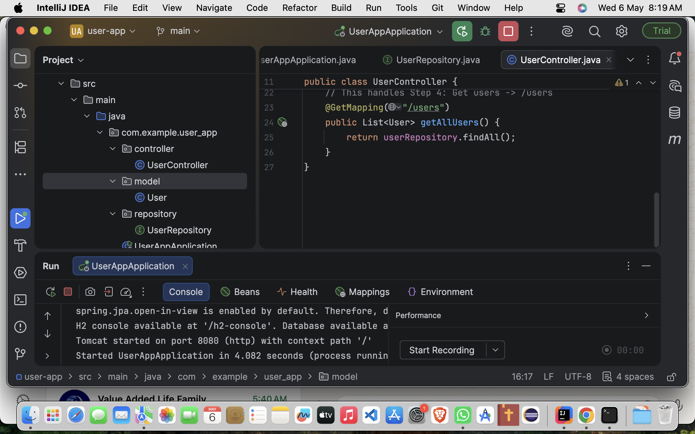
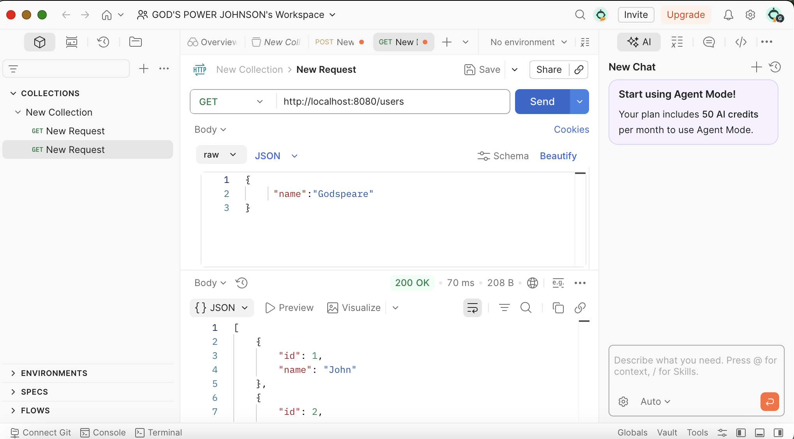
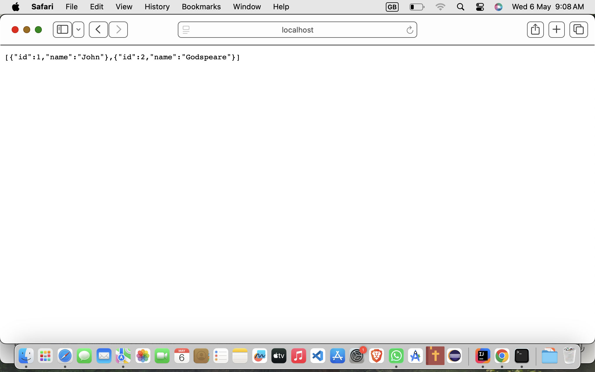
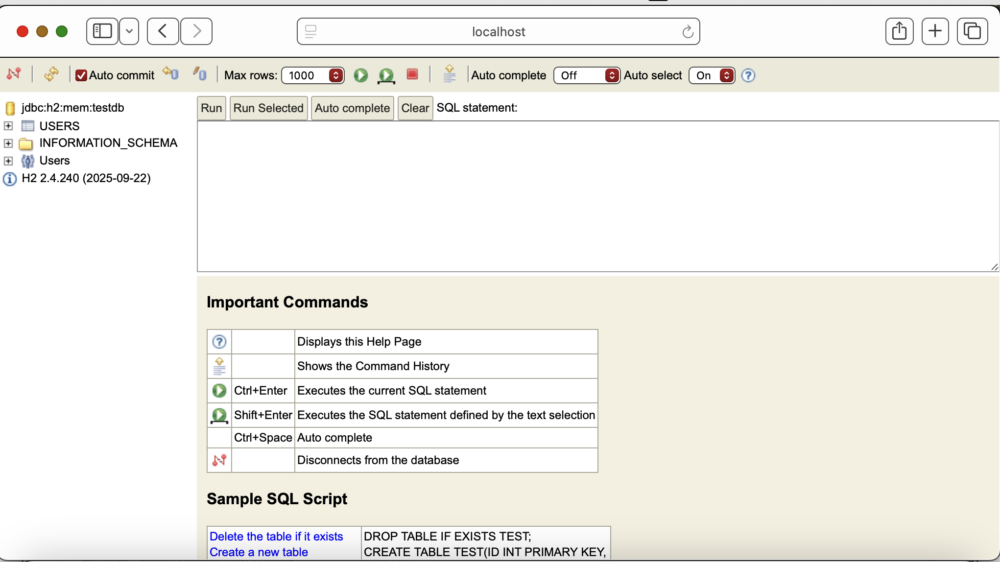

User Management System (Spring Boot & Jakarta EE)

This is a backend REST API built with Spring Boot and Jakarta EE. The project demonstrates how to create a simple user management system that stores and retrieves user data using an in-memory H2 database.

Technologies Used

Java 17
Spring Boot 3.x
Spring Data JPA (Hibernate)
H2 Database (In-Memory)
Maven (Dependency Management)
Postman (API Testing)

Project Structure

The application is organized into the following parts:

Controller
Handles incoming HTTP requests and returns responses.

Model
Represents the User entity used in the application.

Repository
Manages database operations using Spring Data JPA.

Service (optional)
Contains business logic if implemented.

Visual Demonstration

Application Startup
This shows the Spring Boot application running successfully on port 8080.

"App Startup" (screenshots/app-run.png)

Creating a New User (POST Request)
This demonstrates sending data using Postman to the /add endpoint.

"Postman Add" (screenshots/postman-add.png)

Retrieving Users (GET Request)
This shows the list of users fetched from the /users endpoint.

"User List" (screenshots/users.png)

H2 Database Console
This confirms that data is stored correctly in the in-memory database.

"H2 Console" (screenshots/console.png)

How to Run the Project

1. Clone the repository

git clone https://github.com/Godspeare/user-app-springboot.git

2. Open the project in IntelliJ IDEA or Eclipse

3. Run the main class (App.java)

4. Open your browser and go to:

http://localhost:8080

API Endpoints

Add User
POST /add

Example request body:
{
"name": "John"
}

Get All Users
GET /users

Purpose of the Project

This project was created to demonstrate:

How to build REST APIs with Spring Boot
How to connect an application to a database
How to perform basic CRUD operations
How to test APIs using Postman

Author
Godspeare Johnson
